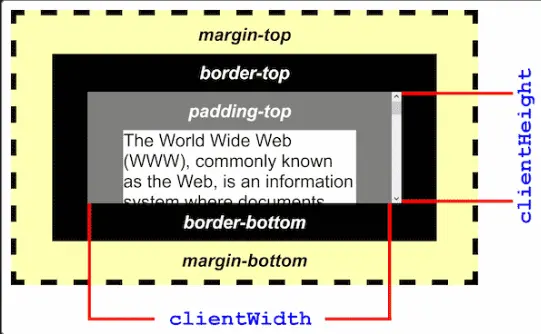

# Hover 3D
Efecto Hover 3D solo con HTML, CSS y JavaScript. Es de un tutorial de [midudev](https://www.youtube.com/shorts/9PxE196WdJ4).

## ¿Qué he aprendido?

### clientHeight -clientWidth
> Es un entero que devuelve el alto o ancho del elemento en píxeles, incluyendo el padding pero **NO** las barras horizontales o verticales; el borde o margen.

### clientX vs layerX vs pageX vs screenX
#### clientX
+ Representa la posición del puntero del mouse en relación con el borde izquierdo de la ventana del navegador.  
+ Especifica la coordenada X en píxeles en la ventana del navegador.
+ No tiene encuenta el desplazamiento de la página (scroll); por lo tanto, es una medida en relación con la ventana visible.
#### pageX
+ Representa la posición del puntero del mouse en relación con el borde izquierdo de toda la página o documento.
+ Toma en cuenta cualquier desplazamiento (scroll) de la página; por lo que si el usuario ha desplazado la página hacia la derecha, `pageX` reflejará esa compensación.
+ Se mide en píxeles y se utiliza para obtener la posición en relación con la página completa.
#### screenX
+ Representa la posición del puntero del mouse en relación con la pantalla del dispositivo.
+ Especifica la coordenada X en píxeles en la pantalla, lo que significa que toma en cuenta la posición del puntero en relación con todo el espacio de la pantalla, independiente de las ventanas del navegador o el contenido de la página web.
+ Puede ser útil para determinar la posición del puntero en un entorno multimonitor o en aplicaciones que interactúan con el sitema de ventanas del sistema operativo.
#### layerX (obsoleto)
+ Representa la posición del puntero del mouse en relación con el elemento HTML en el que ocurrió el evento.
+ Esta propiedad esta obsoleta; en su lugar se recomienda: `clienteX` o `pageX`.
#### Resumen
+ `clientX` y `pageX` son propiedades comunes para obtener la posición del puntero del mouse en relación con el navegador o la página.
+ `screenX` proporciona la posición con la pantalla del dispositivo.
+ `layerX` obsoleto, evitar su uso para web modernas.